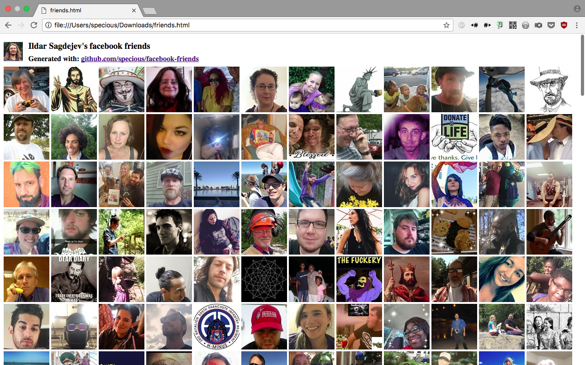

Generate an HTML page showing all of your Facebook friends and click them to visit their profiles.

## How to use

First, `yarn install` dependencies. Then:

- Go to: https://www.facebook.com/me/friends
- Scroll down, repeatedly, until all of your friends are loaded
- Save the page as `in.html`
- *(Optional)* For the ultimate experience, run `in.html` through [inliner](https://github.com/remy/inliner) to create a self-contained HTML file
- Run `./index.js in.html > friends.html`

Open `friends.html` in your browser. Enjoy Facebook!

## Does this work with my friend's friends?

Yes it does.

## License

ISC